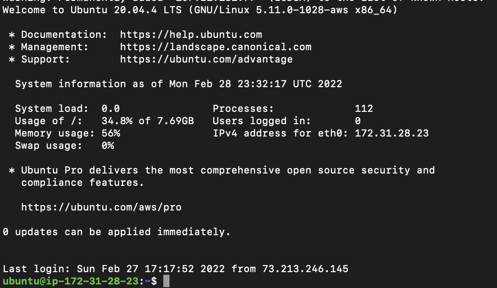
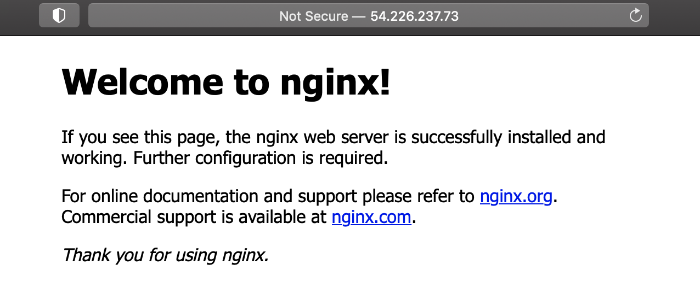

## Project-2-Web-Stack-Implementation-LEMP-Stack

Welcome back! In project one, we focused on deploying the LAMP stack, in this project we'll hone in on LEMP. The term LEMP is an acronym that represents: 

'''

**L** –– Linux Operating System
        >> An operating system that manages all of the hardware resources associated with your desktop or laptop, a.k.a., the communication between your software and hardware

**E** –– Nginx Server **(pronounced as engine-x)**
        >> A high-preforming web server that enables the processing of many requests at the same time

**M** –– MySQL Database
        >> An open-source relational database management system

**P** –– PHP (Hypertext Preprocessor)
        >> A scripting language that communicates with the database MySQL
'''

The Nginix server used in this project, is the main difference in LEMP versus LAMP.

# LINUX

## Setting up your virtual environment

We'll need an AWS account and a virtual server with Ubuntu Server OS. If you don't have one already, follow the steps in my [LAMP Stack](https://github.com/bdunu24/Project-1-Web-Stack-Implementation-LAMP-Stack) project to create a free tier AWS account.

Once you have successfully signed-in to your AWS account, navigate to the top-right of the screen and select your preferred region––this should be the closest region to your physical location.

You'll then want to navigate to the search bar and type in 'EC2.' Select the EC2 service that appears on top.

Click on the 'Launch Instances' button that appears in the top right side of your screen.

Proceed by selecting the Ubuntu Server 20.04 LTS (HVM) option as the Amazon Machine Image (AMI).

On the following page, locate and select t2.micro as the instance type and click 'Review and Launch.'

Next, click on 'Launch' at the bottom of the screen.

A window should appear asking you to create a key pair. Make sure you create one and then select 'Download Key Pair.' **It's important to know the location the file was downloaded to not lose the .pem file. You will need this file in order to connect into your server from your local PC. After you've downloaded the key pair, check the box for the acknowledgement, and then click on "Launch Instances".**

Awesome, you've successfully launched an EC2 instance! 

To view your new instance, click the 'View Instances' button at the bottom-right of the screen.

# Connecting to your EC2 from your local PC

**FRIENDLY REMINDER––** Anchor tags(< >) will be used to indicate contents that must be replaced with your unique values. For example, if you have a file named "keypair123.pem" you must enter this information within the corresponding anchor tag: < private-key-name >

Let's connect to our instance!

Begin by opening Terminal. Once you have opened Terminal, use the 'cd' command to change into the directory that your key pair is located. This is usually the ~/Downloads directory. If you are having difficulty finding it, you can use the 'ls' command to list the contents of your current directory.

Once you have located the key pair, use the command below to activate the key file (.pem). This command will also change permissions (otherwise you may get the error “Bad Permissions”):

    $ sudo chmod 0400 .pem When prompted, type the password for your local PC and press Enter on your keyboard.

When prompted, type the password for your local PC and press Enter on your keyboard.

Next, go back to the AWS console for a moment, and navigate to your running EC2 instance. Copy the Public IP address, as shown in the image below:

Once you have copied the Public IP address, head back to your terminal. You'll want to connect to the EC2 instance by using the following command:

    ssh -i <Your-private-key.pem> ubuntu@<EC2-Public-IP-address>

You will be asked if you want to continue connecting. Type 'Yes' and press 'Enter' on your keyboard.

When connected, your ip-address will be shown on your terminal.

# Installing the Nginx Web Server

Employing Nginx, a high-performance web server, will help us to display web pages to site visitors. First, we'll need to use the apt package manager to install this package. Run the following commands below to get Nginx installed:

    $ sudo apt update

Install Nginx by following the command below:

    $ sudo apt install nginx

When prompted, enter 'Y' to confirm installation.

To verify that your installation was successful and Nginx is now running on your Ubuntu server run the follwing command on your terminal:

    $ sudo systemctl status nginx

If there is a green dot, then you've completed all steps successfully, and it's running.

Prior to receiving any traffic by our Web Server, we need to open TCP port 80––This is the default port that web browsers utilize in order to access web pages on the Internet.

The EC2 instance on the AWS console we created earlier, opened the TCP port 22 by default. This allowed us to access the EC2 via SSH in Terminal. Now, we must add a rule to the security groups of our EC2 configuration, in order to allow inbound connections through port 80.

Open the AWS Management Console. Click on the security group tab and edit the inbound rules of the running EC2 instance.

Click on Edit Inbound Rules

Click on 'Add Rule' and add the HTTP, TCP port 80 and allow source from anywhere by using 0.0.0.0, allowing traffic from any IP address to enter.

Our server is now running and we can access it locally and from the Internet. We'll now test to see whether or not we can receive traffic. Run the following command to request our Nginx on port 80:

    $ curl http://localhost:80

Now we'll test and verify our Nginx server access, using the public IP address of the EC2 instance via web browser. 

    http://<Public-IP-Address>:80

The following screenshot is an example of how the Nginx web default page should look like, if no hiccups have been made.

# Installing MySQL

