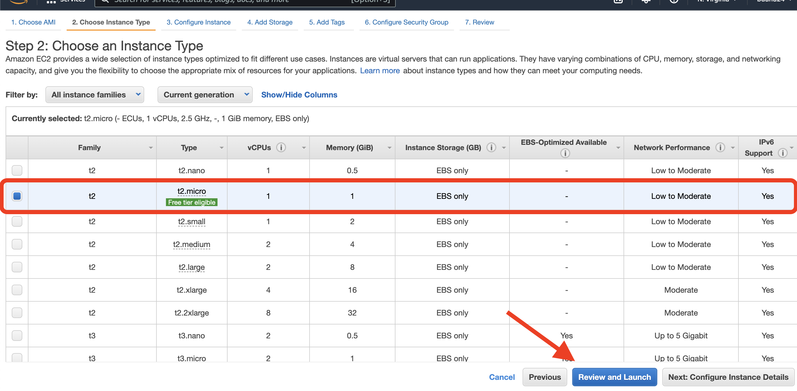

## Project-2-Web-Stack-Implementation-LEMP-Stack

Welcome back! In project one, we focused on deploying the LAMP stack, in this project we'll hone in on LEMP. The term LEMP is an acronym that represents: 

-**L** –– Linux Operating System
        >> An operating system that manages all of the hardware resources associated with your desktop or laptop, a.k.a., the communication between your software and hardware
-**E** –– Nginx Server **(pronounced as engine-x)**
        >> A high-preforming web server that enables the processing of many requests at the same time
-**M** –– MySQL Database
        >> An open-source relational database management system
-**P** –– PHP (Hypertext Preprocessor)
        >> A scripting language that communicates with the database MySQL

The Nginix server used in this project, is the main difference in LEMP versus LAMP.

# LINUX

## Setting up your virtual environment

We'll need an AWS account and a virtual server with Ubuntu Server OS. If you don't have one already, follow the steps in my [LAMP Stack](https://github.com/bdunu24/Project-1-Web-Stack-Implementation-LAMP-Stack) project to create a free tier AWS account.

Once you have successfully signed-in to your AWS account, navigate to the top-right of the screen and select your preferred region––this should be the closest region to your physical location.

You'll then want to navigate to the search bar and type in 'EC2.' Select the EC2 service that appears on top.

Click on the 'Launch Instances' button that appears in the top right side of your screen.

Proceed by selecting the Ubuntu Server 20.04 LTS (HVM) option as the Amazon Machine Image (AMI).

On the following page, locate and select t2.micro as the instance type and click 'Review and Launch.'

Next, click on 'Launch' at the bottom of the screen.

A window should appear asking you to create a key pair. Make sure you create one and then select 'Download Key Pair.' **It's important to know the location the file was downloaded to not lose the .pem file. You will need this file in order to connect into your server from your local PC. After you've downloaded the key pair, check the box for the acknowledgement, and then click on "Launch Instances".**

Awesome, you've successfully launched an EC2 instance! 

To view your new instance, click the 'View Instances' button at the bottom-right of the screen.

# Connecting to your EC2 from your local PC

We'll now connect to our instance.

**FRIENDLY REMINDER––** Anchor tags(< >) will be used to indicate contents that must be replaced with your unique values. For example, if you have a file named "keypair123.pem" you must enter this information within the corresponding anchor tag: < private-key-name >

Now let's connect to our instance!

Begin by opening Terminal. Once you have opened Terminal, use the cd command to change into the directory that your key pair is located. This is usually the ~/Downloads directory. If you are having difficulty finding it, you can use the ls command to list the contents of your current directory.

Once you have located the key pair, use the command below to activate the key file (.pem). This command will also change permissions (otherwise you may get the error “Bad Permissions”):

$ sudo chmod 0400 .pem When prompted, type the password for your local PC and press Enter on your keyboard.

Next, go back to the AWS console for a moment, and navigate to your running EC2 instance. Copy the Public IP address, as shown in the image below:

**Reminder:** You'll want to replace anything inside achor tags, '< >,' with your unique values.

Employing Nginx, a high-performance web server, will help us to display web pages to site visitors. First, we'll need to use the apt package manager to install this package. Run the following commands below to get Nginx installed:

    $ sudo apt update

When prompted, enter your email, then follow the next command:

    $ sudo apt install nginx

Next, you will be asked if you want to continue connecting. Type 'Yes' and press Enter on your keyboard.

